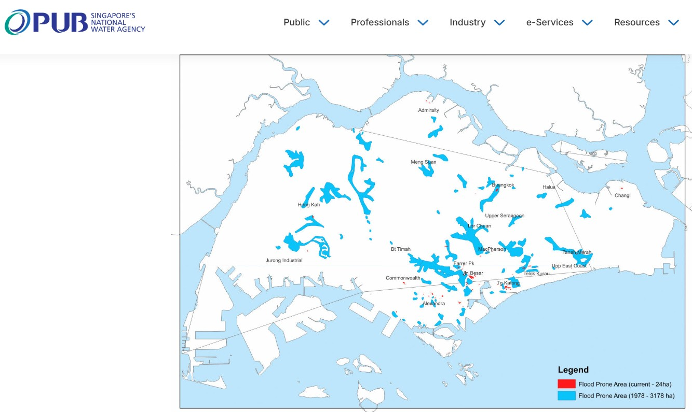
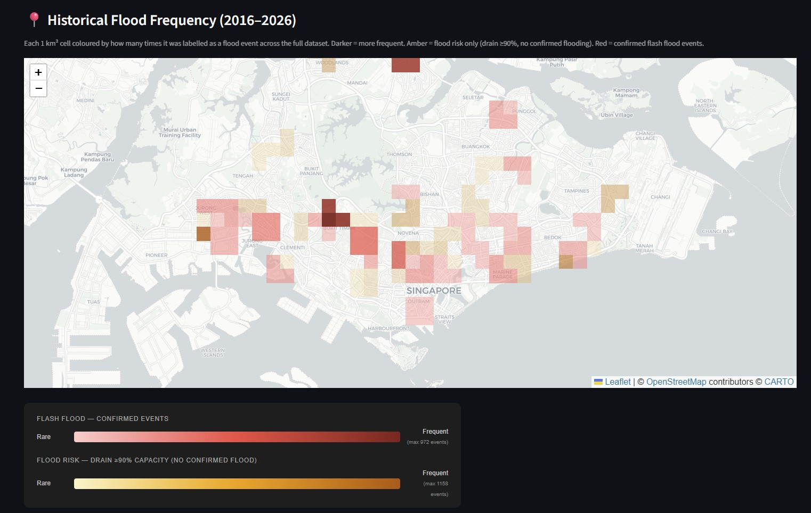

# Singapore Flash Flood Prediction System

An end-to-end machine learning pipeline that predicts flash flood locations in Singapore up to **24 hours in advance**, built entirely on open and public data sources.

Inspired by [Google DeepMind's Groundsource](https://deepmind.google/discover/blog/groundsource-a-global-dataset-of-flood-events/) methodology, adapted to Singapore's specific context.

---

## What it does

1. **Collects** flood event reports from Straits Times articles and PUB's Telegram channel
2. **Extracts** structured flood data (dates, locations) using an LLM pipeline
3. **Geocodes** locations onto a 1 km × 1 km grid covering Singapore's land area
4. **Engineers features** by spatially interpolating NEA rain gauge readings onto the grid and computing rolling rainfall accumulation windows
5. **Trains** a LightGBM ordinal 3-class classifier per grid cell, at two horizons (30 min and 6 hours):
   - **Class 0 — Normal:** baseline conditions
   - **Class 1 — Flood Risk:** PUB's CCTV and drain level sensors have triggered a risk-of-flash-flood warning
   - **Class 2 — Flash Flood:** a confirmed flash flood event has occurred
6. **Serves** predictions and historical data through an interactive Streamlit dashboard

---

## Architecture

```
Data Collection
├── Straits Times articles  ──── LLM extraction (GPT-4o-mini)  ─┐
├── PUB Telegram alerts     ──── Rule-based parser              ─┼─► verified_events.json
└── NEA 5-min rainfall      ──── 60 rain gauge stations         ─┘

Preprocessing
├── Geocoding (Nominatim + manual annotation ground truth)  ──► flood_events.parquet
├── Label generation (±3h window, 24h prediction horizon)  ──► labels.parquet
└── Feature engineering (IDW interpolation + rolling sums) ──► ml_dataset.parquet

Model
├── LightGBM 3-class ordinal (30-min horizon)  ──► lgbm_30min_v2.pkl
└── LightGBM 3-class ordinal (6-hour horizon)  ──► lgbm_6h_v2.pkl

Dashboard (Streamlit)
├── Live Prediction    — fetch current NEA data and predict risk right now
├── Flood Map          — historical flood probability replay across the grid
├── Event Browser      — historical verified flood events
├── Model Dashboard    — multiclass metrics, feature importance, confusion matrix
├── Rainfall Explorer  — NEA station time-series with flood overlays
└── Location Annotator — manual ground-truth annotation tool
```

---

## Data Sources

| Source | Coverage | Access |
|---|---|---|
| [Straits Times](https://www.straitstimes.com) flood articles | 2016–2026 | Manual curation |
| [PUB Telegram](https://t.me/pubfloodalerts) flood alerts | 2022–2026 | Telegram API |
| [NEA rainfall API](https://data.gov.sg/datasets/d_9b8640f89a86e59a730b9eb5d0e0f2c1/view) | Dec 2016–present | data.gov.sg open API |
| [Singapore 1 km grid](https://data.gov.sg) | Static | Derived from URA planning areas |

---

## Reference maps

### PUB Flood-Prone Areas (official)
Ground truth reference showing areas officially designated as flood-prone by Singapore's national water agency.



### Historical Flood Frequency (this model)
Each 1 km² cell coloured by how many times it was labelled a flood event across the full 2016–2026 dataset. Amber = flood risk (CCTV / drain sensors triggered). Red = confirmed flash flood.



---

## Setup

### 1. Clone and install

```bash
git clone https://github.com/your-username/predict-flash-flood.git
cd predict-flash-flood
pip install -r requirements.txt
```

### 2. Configure credentials

```bash
cp .env.example .env
# Edit .env and fill in your API keys:
# - OPENAI_API_KEY  (from platform.openai.com)
# - TELEGRAM_API_ID / TELEGRAM_API_HASH  (from my.telegram.org)
# - ANTHROPIC_API_KEY  (optional — only needed if switching provider in config.yaml)
```

### 3. Run the pipeline (in order)

```bash
# A. Build Singapore location reference database
python -m src.preprocess.build_sg_location_ref

# B. Generate 1km grid
python -m src.preprocess.create_grid

# C. Collect data
python -m src.collect.nea_rainfall_downloader        # ~several hours, rate-limited
python -m src.collect.pub_telegram_scraper           # requires interactive phone auth first run
# Add Straits Times article URLs manually via the Location Annotator page

# D. Extract flood events
python -m src.extract.run_extraction

# E. Geocode + label (after manual verification in Location Annotator)
python -m src.preprocess.geocode_events
python -m src.preprocess.generate_labels

# F. Feature engineering
python -m src.preprocess.feature_engineering

# G. Train model
python -m src.model.train

# H. Launch dashboard
streamlit run app/app.py
```

---

## Keeping data fresh (weekly auto-refresh)

Run the refresh script to pull new Telegram messages and NEA rainfall without re-processing historical data:

```bash
# Telegram + NEA only
python -m src.collect.refresh_data

# Also process a new Straits Times article
python -m src.collect.refresh_data --st-url "https://www.straitstimes.com/..."
```

**Windows Task Scheduler** (runs every Sunday at 3 AM):
```
schtasks /create /tn "FloodDataRefresh" /tr "python -m src.collect.refresh_data" /sc weekly /d SUN /st 03:00
```

After new Telegram flood events arrive: open the Location Annotator page, vet the new entries, then re-run `geocode_events → generate_labels → feature_engineering → train`.

---

## Honest caveats

This is a **data-driven approximation**, not a hydraulic model. Limitations:

- **Small labelled dataset** — only ~64 verified flood events after annotation; most are from 2022–2026
- **Recency bias** — older news articles go offline, so pre-2020 events are underrepresented
- **Spatial imprecision** — events are pinned to a 1 km² cell; true flood extent may differ
- **Rainfall proxy only** — no soil saturation, drainage capacity, or elevation features
- **No recall measurement** — silent floods not reported in ST or Telegram are invisible to this pipeline

This project demonstrates how open, publicly available data can be used to build a reproducible flood prediction baseline using modern ML methodology.

---

## Project structure

```
predict_flash_flood/
├── assets/                 # Reference images for README
├── app/                    # Streamlit dashboard
│   ├── app.py
│   └── pages/
│       ├── live_prediction.py
│       ├── flood_map.py
│       ├── event_browser.py
│       ├── model_dashboard.py
│       ├── rainfall_explorer.py
│       └── location_annotator.py
├── src/
│   ├── collect/            # Data collection scripts
│   ├── parse/              # Rule-based Telegram parser
│   ├── extract/            # LLM extraction pipeline
│   ├── preprocess/         # Geocoding, labels, feature engineering
│   ├── model/              # Training + evaluation
│   └── utils.py
├── data/                   # Gitignored — generated locally
│   ├── raw/
│   └── processed/
├── models/                 # Gitignored — generated locally
├── config.yaml             # All tunable parameters
├── .env.example            # Credential template
└── requirements.txt
```

---

## Tech stack

Python · LightGBM · GeoPandas · Folium · Streamlit · Telethon · OpenAI API · Nominatim · Pandas · NumPy · Shapely

---

## License

MIT — see [LICENSE](LICENSE)
